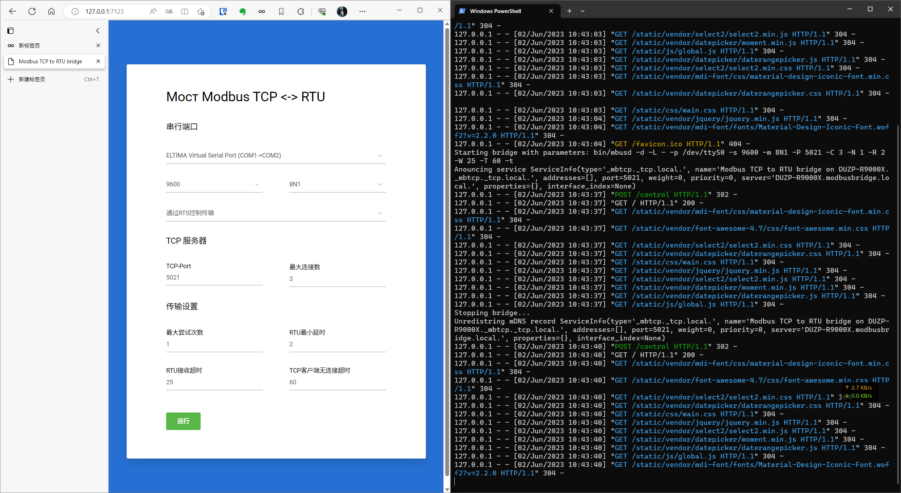
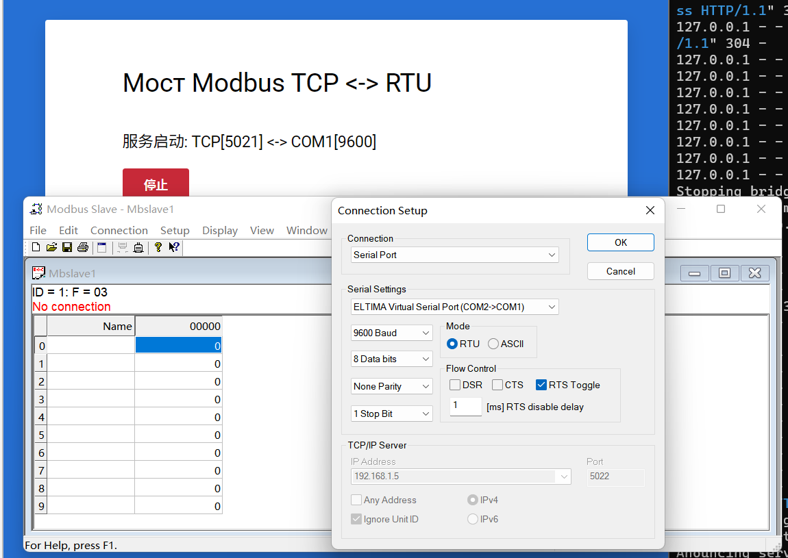
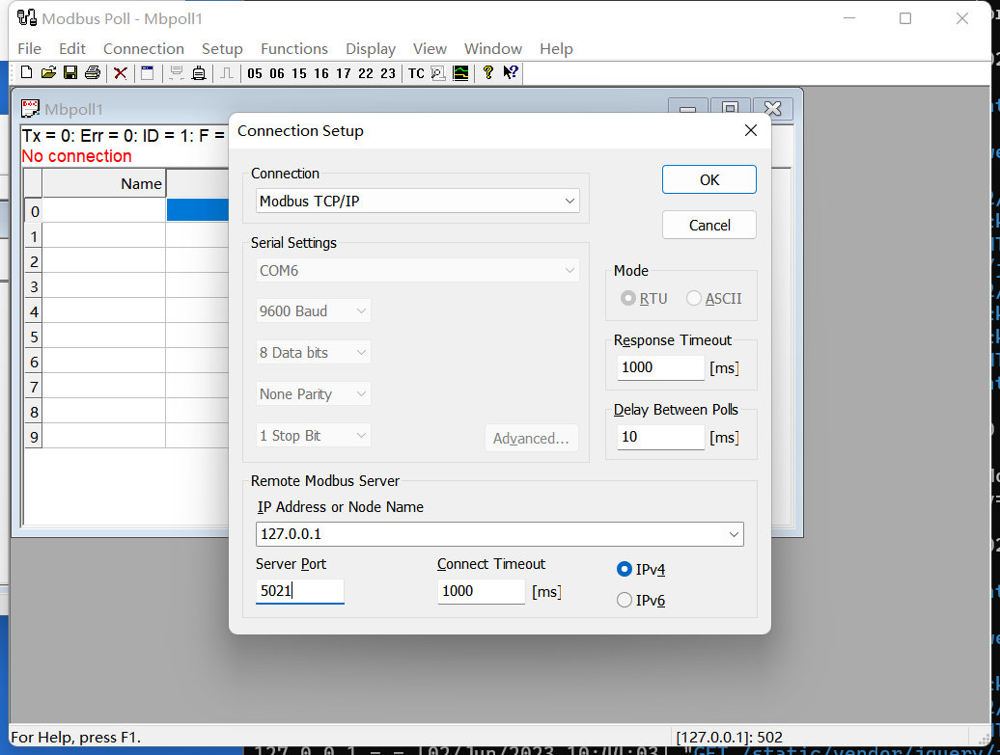
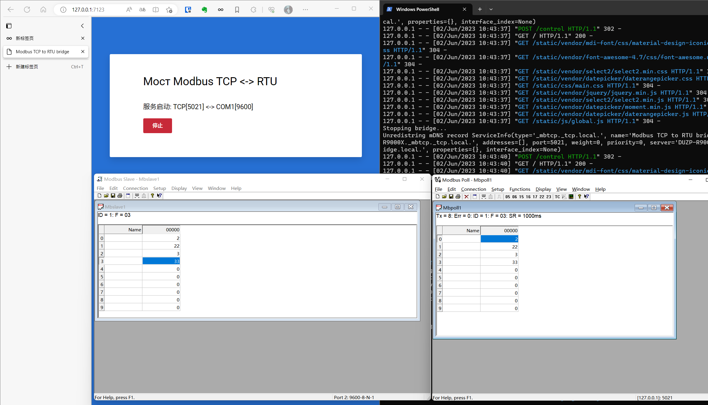

# README

用于配置守护进程的接口 [mbusd](https://github.com/3cky/mbusd)

一个Web应用进程，允许您通过浏览器配置ModbusTCP-RTU桥接器。

## 特性

* 基于 python3 和 Flack
* 使用现成的守护进程_mbusd，必须在其下构建
特定平台并将可执行文档放在 **bin** 目录中
* 支持通过 _pyinstaller_ 打包为单个可执行文件
* 一个服务器和守护进程实例 _mbusd_
* 设置仅保存在一个会话中
* Web 界面端口: 7123
* 支持 mDNS:
  * `_http._tcp.local.` - Config webpage
  * `_mbtcp._tcp.local.` - Bridge server

## 构建 （bin中已经附带编译好的exe 可省略此步骤）

1. 克隆存储库 `mbusd`
2. 编辑文件 CMakeLists.txt (仅适用于 Windows):
    对以下代码进行注释:

```bash
#include(FindSystemd)

#TODO  ISC_Posix,  prog_libtool
# single-configuration generator setup
#SET(BASIC_C_FLAGS "-W -pedantic -fno-builtin-log -Wall")
#SET(CMAKE_C_FLAGS_RELEASE   "${BASIC_C_FLAGS} -O2")
#SET(CMAKE_C_FLAGS_DEBUG     "${BASIC_C_FLAGS} -g")
```

3. 安装 [msys2](https://www.msys2.org/) 根据您的CPU架构 (x86/amd64) (仅适用于 Windows)
4. 使用控制台 `msys2` 安装它的内部 gcc, make & cmake (仅适用于 Windows)

```bash
pacman -Syy
pacman -S gcc make cmake
```

5. 编译 `mbusd`

```bash
cd /<disk>/path/to/mbusd
mkdir build && cd build
cmake ..
make
```

6. 复制生成的可执行文件 `mbusd.exe` 到项目的 bin 子目录
7. 复制库 `msys-2.0.dll` 到项目的 bin 子目录

## 运行

`$ python ModbusBridge.py`

## 打包为单个文件

需要用 python 的 pyinstaller 模块
运行命令

```bash
pyinstaller -w -F -i static/bridge.ico --add-data "bin;bin" --add-data "static;static" --add-data "templates;templates" ModbusBridge.py 
```

可执行文档将出现在“dist”目录中，您可以在任何装有 Windows Vista 或更高版本的计算机上运行

dist目录中有已经打包好的exe，可以直接运行。

## 测试过程

1. 通过VSP虚拟两个串口
2. 打开ModbusBrige, 会自动弹出WEB配置界面
   
3. 设置串口参数和TCP参数，并点击运行。
4. 分别使用ModbusSlave连接虚拟串口模拟从机，ModbusPoll连接TCP模拟主机，进行寄存器操作。
   
   
   